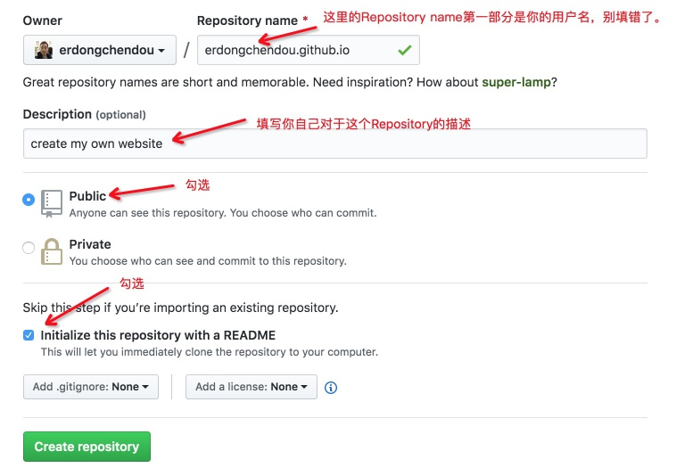
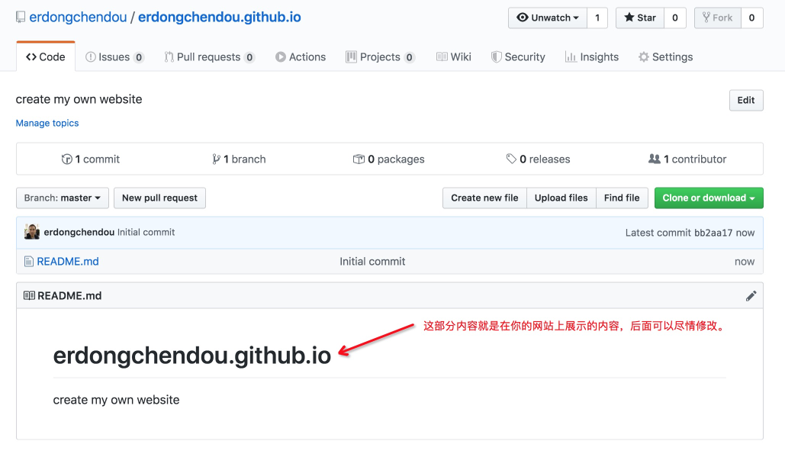

## 背景

相信践行群里的朋友们都知道[笑来](http://lixiaolai.com/#/)老师的[《区块链小白书》](https://blockchainlittlebook.com/#/)，在创作这本书的时候，笑来老师不但把内容、排版都做好了，而且申请了一个网站，将内容发布在这个网站上了，用来让师娘去吹牛。

当你的老婆问你一个全民关心的问题的时候，你想不想也要这样帅气地甩出一个网站给你老婆去吹牛呢？

如果答案是yes的话，那么请继续下去吧，你会发现创作自己的网站其实很容易。

## 工具简介

相信学习过李骏老师编程课的同学，对一下三个工具并不陌生，我这里做一个简单介绍。

1. github
   * github是代码托管工具，就像我们把钱存在银行一样，程序员可以把代码、文档等存在github上。我们需要把我们的网站内容上传到这个网站上，由他们给我们托管。
   * **使用github几乎没有什么技术含量。**
2. git
   * Git 是代码版本管理工具，用来将你的网站内容推送到github上进行托管。
   * [这是李骏老师编写的git简明入门(文字版)](https://github.com/neolee/pilot/blob/master/x3-git-github.ipynb)，[git简明入门(视频版)](https://www.bilibili.com/video/av73411755)，对git不熟悉的同学，强烈建议学习下。

3. markdown

   * 这是一个文档格式生成器，利用它，即使是一个没有任何设计细胞的人（比如我），也可以设计出很好的布局来。
   * 学习这个工具，你还可以体验一把高级编程的经历。
   * [这是李骏老师编写的markdown简明入门(视频版)](https://www.bilibili.com/video/av75225128/)，对不熟悉的同学，强烈建议学习下。

## 制作网站步骤

我们这一部分使用github pages来制作我们的第一个网站，这种方法最简单，而且不需要花费任何费用。

### 1. 申请github账号

[点击进入注册页面](https://github.com/join?source=header-home)，按照提示创建账号即可，就和注册淘宝账号一样比较简单这里略过。

**注意：其中Username申请了就不能修改了，请选择一个自己喜欢的。**

### 2. 创建repository

1. 在页面右上角，点击+下拉菜单，选择**New repository**。
   
2. 按照下图提示，填写Repository name和Description。
   

3. 点击Create repository，之后会进入你的repository的首页，显示如下，其中README.md的内容就是在你的网站上展示的内容：
   

4. 等待20分钟左右之后，打开浏览器，在网址中输入https://yourusername.github.io/，将yourusername替换成你的用户名，即可看到自己的网站了，示例如下。

### 3. 选择主题

通过选择github page自带的主题，可以让网站更酷炫一些

1. 在Repository页面的右上角点击setting，如下图所示。
   

2. 下拉页面到Github Pages，选择chose theme，如下图所示。
   

3. 在跳出的页面中，点击某个主题后，页面会显示该主题的预览效果，选择喜欢的一个主题之后，选择select a theme，如下图所示：
   

4. 在跳出的页面中，github会自动修改readme文件内容，你可以选择手动对其进行修改，也可以选择cancel先默认使用它提供的readme内容。我们为了增加对比效果将他提供的readme文件内容改为了刚创建时的readme，提交后我们的网站就变成下面这个样子了，是不是酷炫了不少：
   

### 3. 修改readme

以上部分就是创建一个网站的步骤了，但是如果想让自己的网站真的有意义，那就需要修改reademe文件了，将github代码库clone到本地，在本地修改readme文件后，提交修改到github，你就可以创建真正有意义的属于自己的网站了。下图是我对readme文件进行修改后展示的效果，也就是以上创建网站的步骤。